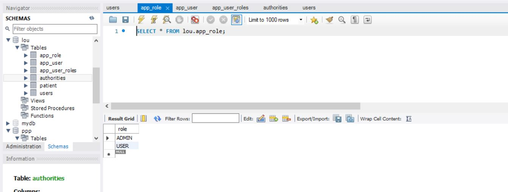
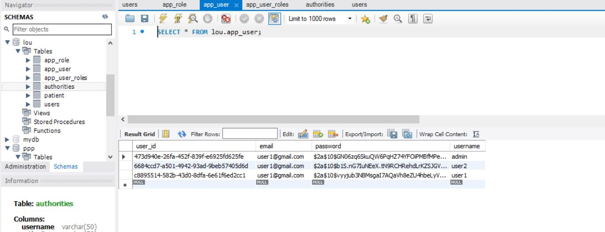
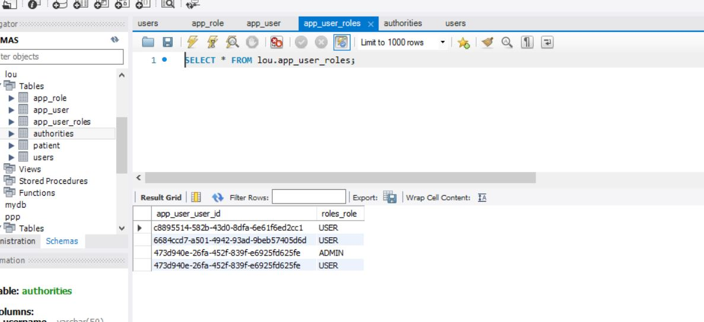
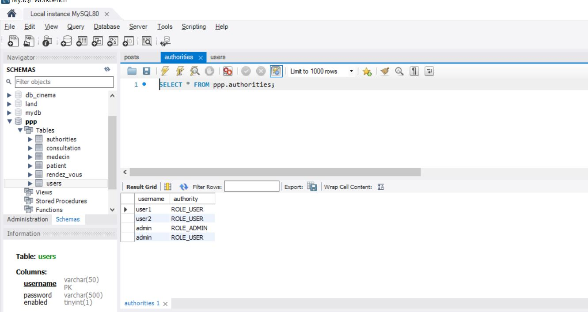
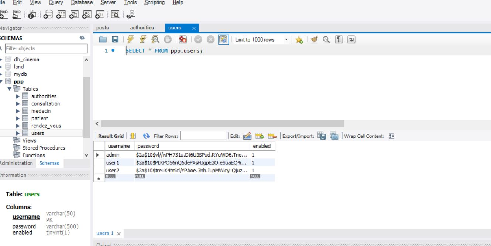
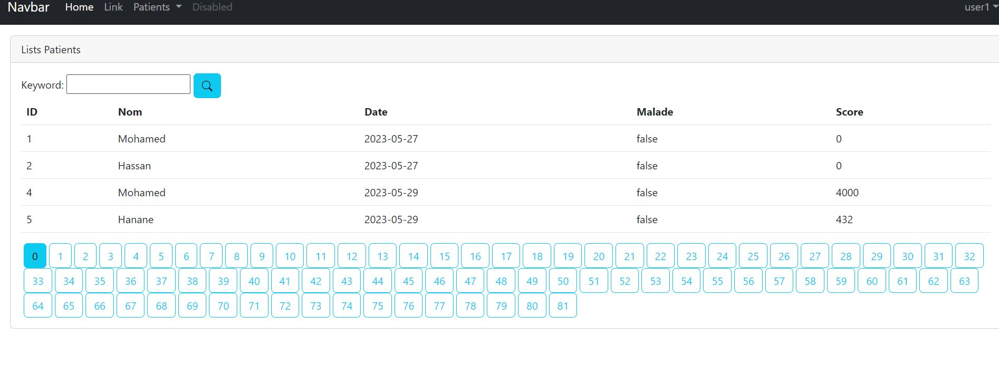
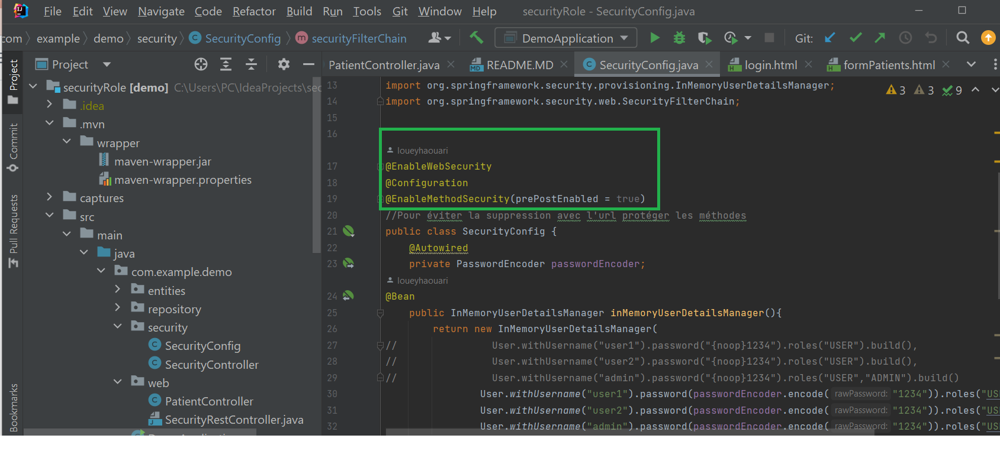
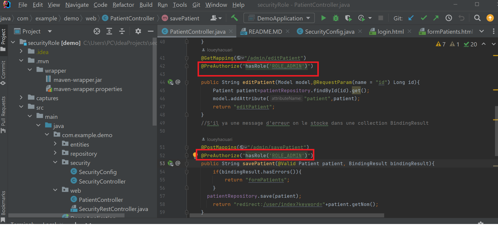
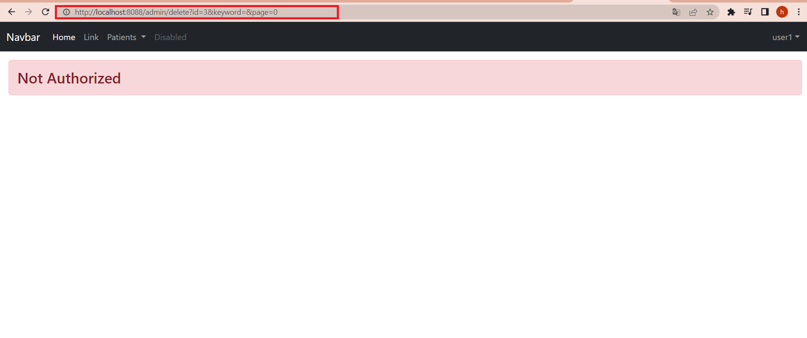

<h3>UserDetailsService</h3>
<h3>Table role</h3>

<h3>Table user</h3>

<h3>Table role_user</h3>

<h3>JdbcUserDetailManager</h3>
<h1>Table authorities</h1>

<h1>Table users bcrypt</h1>

<h3>Partie User élimination des bouton modifier et supprimer avec spring security</h3>

<h3>Protéger notre site pour ne pas etre supprimé </h3>

